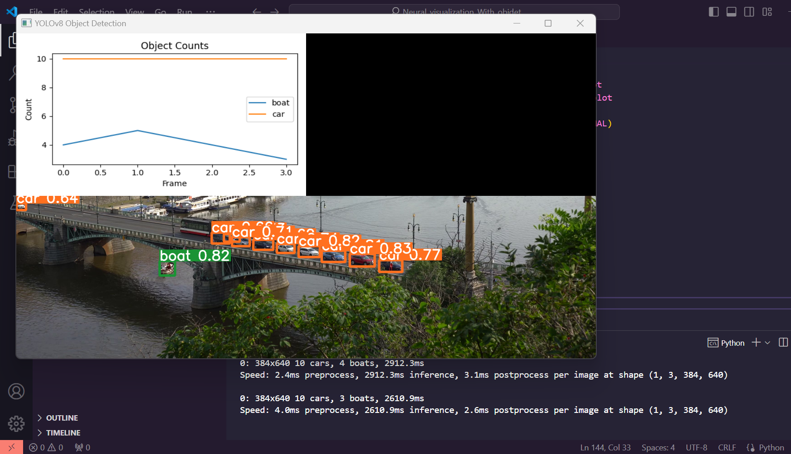
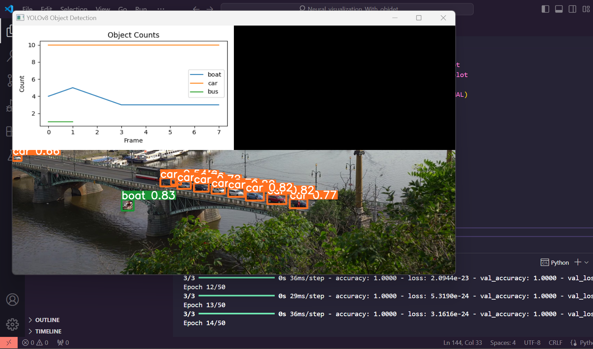
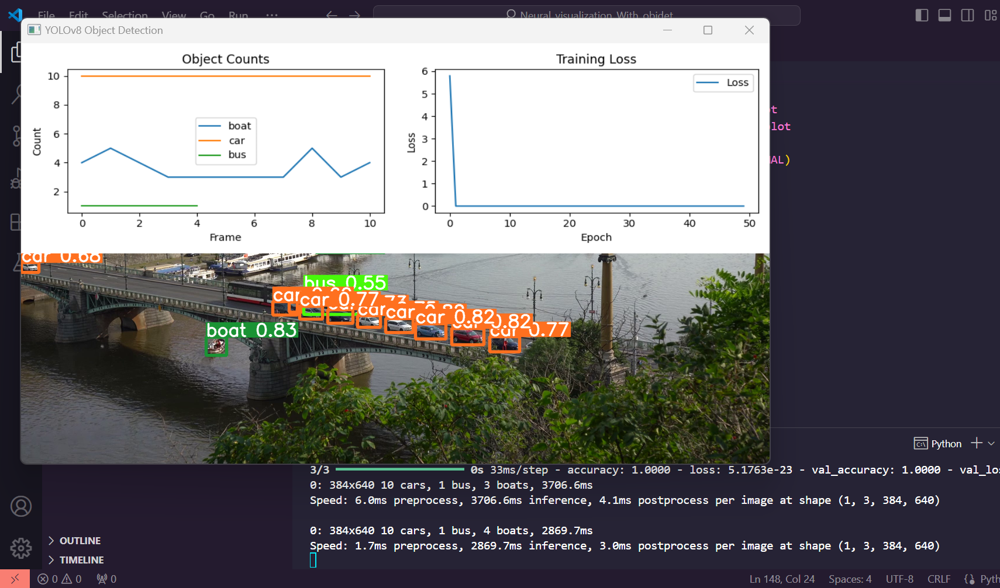
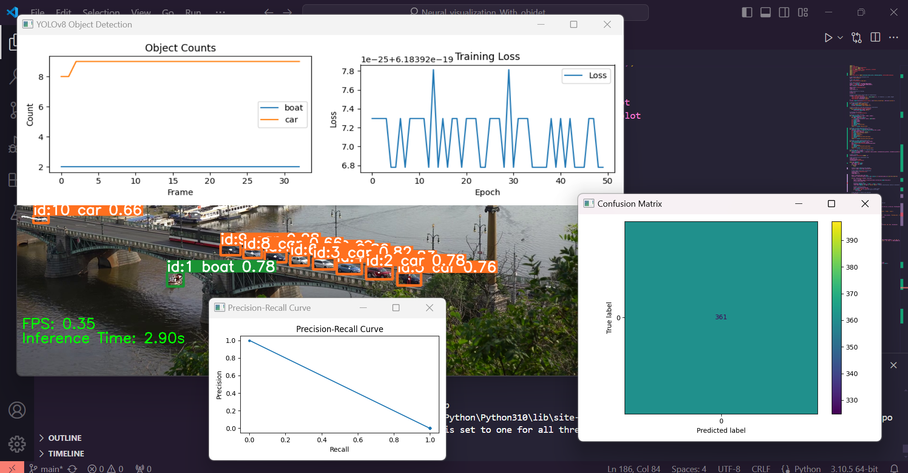

# Real-time Object Detection and Neural Network Training Visualization

## Overview
This project combines real-time object detection using YOLOv8 with concurrent neural network training visualization. It processes a video stream, detects objects, collects training data, and simultaneously displays object counts and neural network training progress.

<h1 align="center">




</h1>

## Features
- Real-time object detection using YOLOv8
- Concurrent neural network training on detected objects
- Live visualization of object counts and training loss
- Multithreaded processing for smooth performance

## Requirements
- Python 3.7+
- OpenCV
- NumPy
- Matplotlib
- Ultralytics YOLO
- TensorFlow/Keras

````
pip install -r requirements.txt
````


